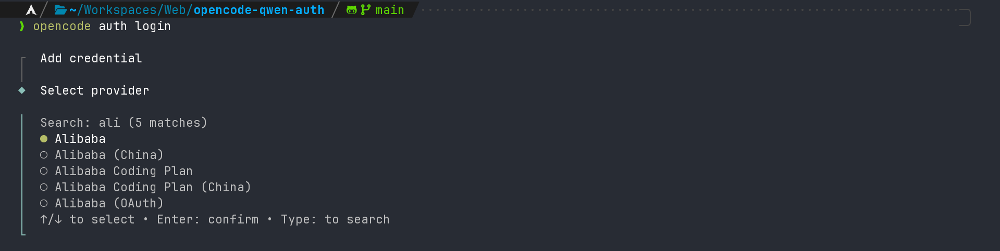

# opencode-qwen-auth

[](https://www.npmjs.com/package/opencode-qwen-auth)
[](https://www.npmjs.com/package/opencode-qwen-auth)
[](https://github.com/aikerary/opencode-qwen-auth/actions)
[](./LICENSE)
[](https://www.typescriptlang.org/)

**OpenCode plugin** for authenticating with Qwen models via Alibaba Cloud OAuth — device code flow with PKCE.  
No API key required. Just log in with your Alibaba Cloud / Qwen account.

---

## Features

- **Zero API key** — authenticates via OAuth 2.0 device code flow (RFC 8628)
- **PKCE** — secure code challenge / verifier exchange (S256)
- **Auto token refresh** — transparently refreshes expired access tokens before every request
- **Dynamic endpoint routing** — rewrites requests to the `resource_url` returned by the OAuth server
- **OpenCode native** — integrates with OpenCode's plugin and auth system

---

## Requirements

- [OpenCode](https://github.com/sst/opencode) ≥ 0.3.x
- [Bun](https://bun.sh) ≥ 1.x (only needed for the local plugin option)
- An [Alibaba Cloud / Qwen](https://chat.qwen.ai) account

---

## Installation

### Option A: npm (recommended)

```bash
# Add to your opencode.json
{
  "plugin": ["opencode-qwen-auth"]
}
```

Or install globally and reference by path:

```bash
npm install -g opencode-qwen-auth
```

### Option B: Local plugin

Copy the plugin into your OpenCode plugins folder:

```bash
# Global (all projects)
cp -r opencode-qwen-auth ~/.config/opencode/plugins/qwen-auth

# Or project-level
cp -r opencode-qwen-auth .opencode/plugins/qwen-auth
```

When using as a local plugin, OpenCode loads `src/index.ts` directly via Bun — no build step needed.

---

## Configuration

Add the `alibaba-oauth` provider to your `opencode.json` so OpenCode knows which models are available:

```json
{
  "plugin": ["opencode-qwen-auth"],
  "provider": {
    "alibaba-oauth": {
      "name": "Alibaba (OAuth)",
      "npm": "@ai-sdk/openai-compatible",
      "api": "https://dashscope-intl.aliyuncs.com/compatible-mode/v1",
      "models": {
        "coder-model": {
          "name": "Qwen Coder",
          "family": "qwen",
          "reasoning": true,
          "tool_call": true,
          "temperature": true,
          "modalities": {
            "input": ["text", "image", "video"],
            "output": ["text"]
          },
          "limit": {
            "context": 1000000,
            "output": 65536
          }
        }
      }
    }
  }
}
```

> `coder-model` is the model ID exposed by the Qwen OAuth endpoint. Do not change this key — it is the only valid value when authenticating via OAuth (as opposed to a direct API key).

---

## Authentication

```bash
opencode auth login
# Select "Alibaba (OAuth)" → follow the device code flow in your browser
```

Or via the TUI: press `p` to open the provider picker and select **Alibaba (OAuth)**.

### Screenshots

**Login with OAuth:**



**Model Selection:**


**Model Running:**


---

## How it works

```
opencode  →  plugin  →  device code request  →  chat.qwen.ai
                     ←  device_code + verification_uri

user visits verification_uri, authorizes app

plugin polls TOKEN_URL until access_token is issued
     →  stores { refresh, access, expires, resource_url } via opencode auth

on each request:
  1. check token expiry / missing resource_url
  2. refresh if needed (auto-updates stored auth)
  3. rewrite request URL to resource_url endpoint
  4. inject Bearer token + DashScope headers
```

| Step | Detail |
|------|--------|
| Device code flow | RFC 8628 against `chat.qwen.ai/api/v1/oauth2/device/code` |
| PKCE | SHA-256 code challenge, base64url-encoded |
| Token storage | OpenCode's built-in auth system (`opencode auth set`) |
| Auto-refresh | Triggered on expiry or missing `resource_url` |
| URL rewriting | Normalizes `resource_url` to a valid `/v1` base, rewrites each API call |
| Rate limiting | Exponential backoff on `slow_down` (429) during polling |

---

## Contributing

Contributions are welcome! Please read [CONTRIBUTING.md](./CONTRIBUTING.md) before opening a PR.

---

## License

[MIT](./LICENSE) © aikerary
